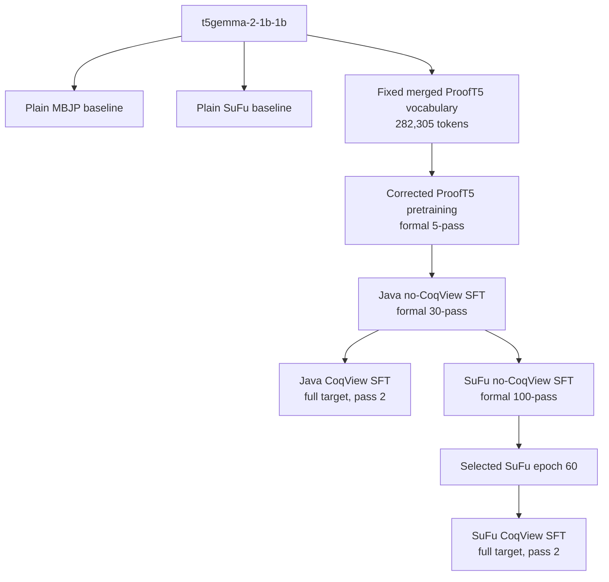

# ProofT5 Model Training Inventory

Last updated: 2026-07-30 (UTC)

This document is the canonical handoff note for trained models and training
data in `/data2/x/hzc/prooft5`. It is intended for future Codex sessions and
human collaborators.

The main rule is:

> Do not select a model merely because its directory is newest. Use the
> canonical paths and parent relationships recorded below.

## 1. Scope And Status Labels

This inventory separates local assets into three classes:

| Class | Meaning |
|---|---|
| Canonical | A model or dataset on the current reproducible experiment path |
| Historical | A completed older experiment retained for comparison |
| Diagnostic | Smoke tests, overfitting probes, learning-rate searches, cache tests, or no-update runs |

`Utils/models/` contains many diagnostic directories from the July 2026
CoqView debugging period. Those directories are not all independent formal
models and should not be reported as paper results.

## 2. Current T5Gemma2 Lineage

The base model called "2B" in this repository is Google's
`t5gemma-2-1b-1b`: approximately 1B encoder parameters plus 1B decoder
parameters.

The downloaded base model is stored at:

```text
Utils/models/t5gemma-2-1b-1b/
```

The current training lineage is:



The vocabulary is merged once before pretraining and remains unchanged during
Java SFT, SuFu SFT, and both CoqView stages.

## 3. Canonical T5Gemma2 Models

### 3.1 Plain Baseline: MBJP

This is conventional text-to-code fine-tuning and generation. It does not use
the ProofT5 vocabulary, grammar model, or constrained decoding.

Base model:

```text
Utils/models/t5gemma-2-1b-1b/
```

Source data:

```text
t5_llm/data/mbjp_t5.json
```

Split sizes:

```text
train: 541
valid: 67
test:   67
```

Canonical checkpoint:

```text
t5_llm/models/t5gemma2-2b_mbjp/2026-06-30_11-24-20/best/
```

Generated candidates:

```text
Utils/output/t5gemma2-2b_mbjp_test_ans/2026-06-30_11-24-20/best/
```

Recorded problem success rate:

```text
28.36% (19/67)
```

The corresponding row is in `Utils/score_output/result.csv`. The later
`22.39%` field in that row is the candidate compilation-error rate, not
pass@10.

### 3.2 Plain Baseline: SuFu

This is also conventional fine-tuning and unconstrained generation.

Source data:

```text
t5_llm/data/sufu_t5.json
```

Split sizes:

```text
train: 232
valid:   0
test:   58
```

The baseline script uses the test rows as validation rows when the JSON has no
explicit SuFu validation split.

Canonical checkpoint:

```text
t5_llm/models/t5gemma2-2b_sufu/2026-06-30_11-24-20/best/
```

Generated candidates:

```text
Utils/output/t5gemma2-2b_sufu_test_ans/2026-06-30_11-24-20/best/
```

Recorded problem success rate:

```text
44.83% (26/58)
```

### 3.3 Shared-Vocabulary ProofT5 Pretraining

Canonical data:

```text
Utils/data/pretrain_t5gemma2_2b_retok/
```

Training size:

```text
train: 9,856
```

Important data artifacts:

```text
train.pkl
train.json
tokenizer.pkl
coq_tokenizer.pkl
rules.pkl
rules.json
config.json
```

Vocabulary size:

```text
282,305
```

Canonical corrected parent model:

```text
Utils/models/Modelpretrain_t5gemma2_2b_retok_corrected_formal5pass_lr1em5_8gpu_b5_20260715_1412/
```

Canonical checkpoint:

```text
Utils/models/Modelpretrain_t5gemma2_2b_retok_corrected_formal5pass_lr1em5_8gpu_b5_20260715_1412/last_model.ckpt
```

Checkpoint SHA256:

```text
2ff91da81d96a3f7dd7814111f196ed836f4c9c2c1d568348515bdfa53184811
```

Historical full pretraining runs also exist at:

```text
Utils/models/Modelpretrain_t5gemma2_2b_retok/2026-07-04_19-52-57/
Utils/models/Modelpretrain_t5gemma2_2b_retok/2026-07-06_08-53-15/
```

They contain epoch 20/40/60/80/100 checkpoints, but they are not the direct
parent recorded by the current corrected Java and SuFu lineage.

### 3.4 Java ProofT5 SFT Without CoqView

Role:

```text
Java/MBJP SFT using the fixed ProofT5 vocabulary and ordinary teacher forcing
without CoqView-history training.
```

Canonical data task:

```text
Utils/data/mbjpcoq_t5gemma2_2b_retok_promptprefix_corrected_from_pretrain5_20260715/
```

Underlying data source recorded in `lineage.json`:

```text
mbjpcoq_t5gemma2_2b_retok_promptprefix_lr1e4
```

Split sizes:

```text
train: 541
valid: 67
test:   67
```

Direct parent:

```text
pretrain_t5gemma2_2b_retok_corrected_formal5pass_lr1em5_8gpu_b5_20260715_1412
```

Canonical model:

```text
Utils/models/Modelmbjpcoq_t5gemma2_2b_corrected_formal30pass_lr1em5_8gpu_b5_20260715_163958/
```

Canonical checkpoint:

```text
Utils/models/Modelmbjpcoq_t5gemma2_2b_corrected_formal30pass_lr1em5_8gpu_b5_20260715_163958/last_model.ckpt
```

Checkpoint SHA256:

```text
c733e7fba3be101b150a27e5df1e0d020480ef8e6110f4d54dcbdbdde701f39d
```

Saved intermediate checkpoints include epochs 5, 10, 15, 20, and 25. The
`last_model.ckpt` is the formal-30 result and is the strict direct parent for
the current Java CoqView and SuFu no-CoqView branches.

### 3.5 SuFu ProofT5 SFT Without CoqView

This stage intentionally continues from the corresponding Java no-CoqView
model. It does not restart from pretraining.

Canonical data task:

```text
Utils/data/sufucoq_t5gemma2_2b_retok_promptprefix_corrected_from_java30_20260715/
```

Underlying data source:

```text
sufucoq_t5gemma2_2b_retok_promptprefix_lr1e4_from_java
```

Split sizes:

```text
train: 232
valid:   0
test:   58
```

Direct parent:

```text
Utils/models/Modelmbjpcoq_t5gemma2_2b_corrected_formal30pass_lr1em5_8gpu_b5_20260715_163958/last_model.ckpt
```

Canonical full run:

```text
Utils/models/Modelsufucoq_t5gemma2_2b_corrected_formal100pass_lr5em5_8gpu_b5_20260715_172939/
```

Saved checkpoints:

```text
2026-07-15_17-29-57/epoch20_model.ckpt
2026-07-15_17-29-57/epoch40_model.ckpt
2026-07-15_17-29-57/epoch60_model.ckpt
2026-07-15_17-29-57/epoch80_model.ckpt
2026-07-15_17-29-57/final_model.ckpt
```

The checkpoint selected as the parent of SuFu CoqView is epoch 60:

```text
Utils/models/Modelsufucoq_t5gemma2_2b_corrected_formal100pass_lr5em5_8gpu_b5_20260715_172939/2026-07-15_17-29-57/epoch60_model.ckpt
```

It is exposed as an explicit strict parent task:

```text
Utils/models/Modelsufucoq_t5gemma2_2b_corrected_formal100pass_lr5em5_8gpu_b5_20260715_172939_epoch60_parent_20260718/last_model.ckpt
```

Selected checkpoint SHA256:

```text
16e19bca4cbdf5d9fe72c381b09defa752dc5fdfee5136c2908d130dd57c8332
```

### 3.6 Java ProofT5 SFT With CoqView

This stage continues from Java no-CoqView formal-30. It must not start directly
from pretraining.

Canonical data task:

```text
Utils/data/mbjpcoqview_t5gemma2_2b_corrected_from_java30_fullseq_prefixpadfix_b1_20260718/
```

The immutable data artifacts originate from:

```text
Utils/data/mbjpcoqview_t5gemma2_2b_corrected_from_java30_prefixpadfix_b1_20260718/
```

Split sizes:

```text
train: 541
valid: 67
test:   67
```

Direct parent:

```text
Utils/models/Modelmbjpcoq_t5gemma2_2b_corrected_formal30pass_lr1em5_8gpu_b5_20260715_163958/last_model.ckpt
```

Canonical full-target run:

```text
Utils/models/Modelmbjpcoqview_t5gemma2_2b_corrected_from_java30_fullseq_prefixpadfix_b1_20260718_8gpu_b1_lr5em6_pass2_full_20260720_060200/
```

Canonical checkpoint:

```text
Utils/models/Modelmbjpcoqview_t5gemma2_2b_corrected_from_java30_fullseq_prefixpadfix_b1_20260718_8gpu_b1_lr5em6_pass2_full_20260720_060200/2026-07-20_06-02-26/final_model.ckpt
```

Training characteristics recorded in the data lineage:

```text
world size:                    8
batch size per rank:           1
global batch size:             8
parameter dtype:               fp32
forward precision:             bf16 autocast
history gradient policy:       streaming_detached_self_kv
training target policy:        full target suffix every pass
beam score policy:             fp32 log-softmax
vocabulary changed:            false
optimizer/RNG resumed:         false
```

The batch size of one per rank is intentional. It prevents unmasked
variable-prefix left padding from changing CoqView history and matches
batch-one constrained inference.

### 3.7 SuFu ProofT5 SFT With CoqView

This stage continues from the selected SuFu no-CoqView epoch-60 checkpoint.

Canonical data task:

```text
Utils/data/sufucoqview_t5gemma2_2b_corrected_from_sufu60_fullseq_b1_20260718/
```

Split sizes:

```text
train: 232
valid:   0
test:   58
```

Direct parent:

```text
Utils/models/Modelsufucoq_t5gemma2_2b_corrected_formal100pass_lr5em5_8gpu_b5_20260715_172939_epoch60_parent_20260718/last_model.ckpt
```

Canonical full-target run:

```text
Utils/models/Modelsufucoqview_t5gemma2_2b_corrected_from_sufu60_fullseq_b1_20260718_8gpu_b1_lr5em6_pass2_full_20260720_033902/
```

Canonical checkpoint:

```text
Utils/models/Modelsufucoqview_t5gemma2_2b_corrected_from_sufu60_fullseq_b1_20260718_8gpu_b1_lr5em6_pass2_full_20260720_033902/2026-07-20_03-39-31/final_model.ckpt
```

Its precision, batching, vocabulary, cache-history, and strict-parent policies
match the Java CoqView formal run.

## 4. Data Directory Contract

ProofT5 task data live under:

```text
Utils/data/<task>/
```

A complete T5Gemma2 ProofT5 task normally contains:

| File | Purpose |
|---|---|
| `train.pkl` | Runtime training examples |
| `valid.pkl` | Validation examples when the benchmark has a validation split |
| `test.pkl` | Test examples |
| `train.json`, `valid.json`, `test.json` | Inspectable representations |
| `tokenizer.pkl`, `coq_tokenizer.pkl` | Fixed tokenizer artifacts |
| `rules.pkl`, `rules.json` | Token/rule vocabulary and IDs |
| `config.json` | Runtime model, length, batching, and parent configuration |
| `lineage.json` | Exact parent, source data, vocabulary, and implementation policy |
| `build_report.json` | Data-conversion diagnostics for corrected CoqView tasks |

For current T5Gemma2 tasks, `lineage.json` takes precedence over assumptions
made from the directory name.

## 5. Historical CodeT5 ProofT5 Models

These are the original paper-oriented CodeT5-based ProofT5 models. They remain
important for regression comparison.

| Stage | Data | Model |
|---|---|---|
| Grammar pretraining | `Utils/data/pretrain/` | `Utils/models/Modelpretrain/` |
| Java no-CoqView | `Utils/data/mbjpcoq/` | `Utils/models/Modelmbjpcoq/` |
| Java CoqView | `Utils/data/mbjpcoqview/` | `Utils/models/Modelmbjpcoqview/` |
| SuFu no-CoqView | `Utils/data/sufucoq/` | `Utils/models/Modelsufucoq/` |
| SuFu CoqView | `Utils/data/sufucoqview/` | `Utils/models/Modelsufucoqview/` |

Dataset sizes:

| Dataset | Train | Valid | Test |
|---|---:|---:|---:|
| `pretrain` | 9,856 | - | - |
| `mbjpcoq` | 541 | 67 | 67 |
| `mbjpcoqview` | 541 | 67 | 67 |
| `sufucoq` | 232 | - | 58 |
| `sufucoqview` | 232 | - | 58 |

Important historical checkpoints include:

```text
Utils/models/Modelpretrain/2025-06-02_17-09-40/
Utils/models/Modelmbjpcoq/2025-06-11_11-41-16/
Utils/models/Modelmbjpcoqview/2025-06-20_16-57-57/
Utils/models/Modelsufucoq/2025-06-07_21-03-51/
Utils/models/Modelsufucoqview/2025-06-19_20-01-51/
```

Additional conventional CodeT5/CodeT5+ baselines are under:

```text
t5_llm/models/
```

They include `codet5-base_mbjp`, `codet5-base_sufu`, code-to-proof,
proof-to-code, and CodeT5+ 770M experiments. These are baseline families, not
the T5Gemma2 ProofT5 lineage described in Section 3.

## 6. Relevant Implementation Files

| File | Responsibility |
|---|---|
| `run.py` | ProofT5 training/evaluation entry point and distributed control |
| `ModelT5Gemma2.py` | T5Gemma2 model adaptation, loss, cache, and CoqView history |
| `Dataset.py` | Task loading, batching, and distributed padding |
| `beamsearch.py` | Java constrained decoding |
| `beamsearch_coq.py` | Coq/CoqView constrained decoding |
| `beamsearch_sufu.py` | SuFu decoding |
| `beamsearch_sufu_cd.py` | SuFu constrained-decoding path |
| `beamsearch_cache.py` | Shared cache reordering/detachment helpers |
| `coq_model/program_model.py` | Program/proof token model and detokenization |
| `prepare_t5gemma2_retokenized_prooft5_data.py` | Shared-vocabulary data conversion |
| `prepare_t5gemma2_java_coqview_promptprefix.py` | Java CoqView data construction |
| `prepare_t5gemma2_sufu_coqview_ctxfix.py` | SuFu CoqView context correction |
| `t5_llm/finetune_t5gemma2.py` | Plain T5Gemma2 baseline training |

Formal regression tests are under `tests/`.

## 7. Diagnostic Directories

Directories whose names contain terms such as the following should be treated
as diagnostic unless a lineage file explicitly promotes them:

```text
smoke
dryrun
overfit
noupdate
lr0
preflight
grid
beammargin
frontier
boundary
rank
cachefix
manualdist
step1
step2
```

Many such directories are useful debugging evidence, but they are not separate
paper models. Do not report their metrics as canonical results.

## 8. Storage And Git Policy

The following are intentionally ignored by Git:

```text
Utils/models/*
Utils/data/*/
Utils/output/*
t5_llm/models/
t5_llm/outputs/
/tmp/
/Utils/tensorboard/
```

Therefore, a Git commit does not back up checkpoints, processed datasets,
outputs, or TensorBoard runs. These assets need filesystem-level backup or
explicit transfer.

Checkpoint cleanup has hard-linked byte-identical duplicate files. Different
logical checkpoint paths may therefore share the same inode while remaining
valid paths.

## 9. Protected Results

Do not modify without explicit user approval:

```text
Utils/score_output/results_final.csv
tosem/paper/ tables and result text
```

Frozen `results_final.csv` SHA256:

```text
fbd622f6e216f309b54f15af748862e30b67d8e2c007fc7785af0e22759e5f95
```

`Utils/score_output/result.csv` is the working experiment ledger and currently
contains the reproduced plain T5Gemma2 MBJP and SuFu baseline rows.

## 10. Checklist For A New Session

Before training or evaluation:

1. Read this file and `PROJECT_STRUCTURE.md`.
2. Read the selected task's `config.json` and `lineage.json`.
3. Verify that the exact parent checkpoint exists.
4. Record the parent checkpoint SHA256.
5. Confirm vocabulary size `282305` for the current T5Gemma2 ProofT5 path.
6. Do not add tokens after pretraining.
7. Use strict model loading; do not silently fall back to another checkpoint.
8. Keep no-CoqView and CoqView model/data task names separate.
9. Do not overwrite existing checkpoints, generated outputs, or result tables.
10. Treat a new training run as non-canonical until its data, parent, config,
    checkpoint, and evaluation evidence are recorded.
