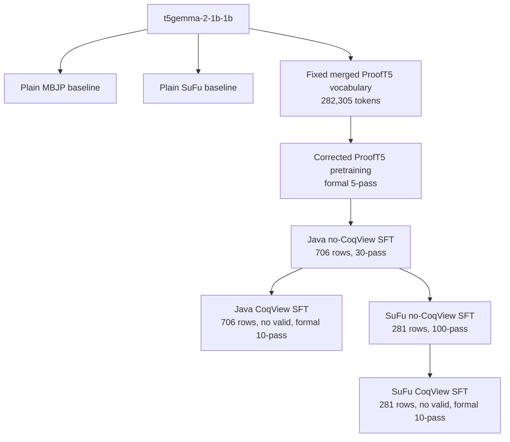

# ProofT5 Model Training Inventory

Last updated: 2026-08-24 (UTC)

This document is the canonical handoff note for trained models and training
data in `/data2/x/hzc/prooft5`. It is intended for future Codex sessions and
human collaborators.

The main rule is:

> Do not select a model merely because its directory is newest. Use the
> canonical paths and parent relationships recorded below.

## 0. Frozen major-revision Java models (2026-08-24)

This section supersedes older Java-expansion checkpoint choices below. The
exact paths and full hashes are machine-readable in
`artifacts/major_revision_20260824/MANIFEST.json`; results and limitations are
in `docs/MAJOR_REVISION_FINAL_PACKAGE_20260824.md`.

Only five unique Java checkpoints are retained for the final six-row table:

| Scope | Model | Frozen checkpoint |
|---|---|---|
| MBJP | T5Gemma2 | `t5_llm/models/t5gemma2-2b_java_clean673_noleak_b5_lr5em5_pass30_20260811_after_clean_coqview/20260811_after_clean_coqview/epoch_20` |
| MBJP | ProofT5 | `Utils/models/Modelmbjp_humaneval_half_train_t5gemma2_20260731_clean673_noleak_formal30_8gpu_b5_lr1em5_20260810/last_model.ckpt` |
| HumanEval-Java v15 | T5Gemma2 | `t5_llm/models/t5gemma2-2b_java_mbjp_humaneval_semanticsupport1082_v15_plain_selected_20260822` |
| TransCoder-GFG v13 | T5Gemma2 | `t5_llm/models/t5gemma2-2b_java_mbjp_transcoder_gfg_mbjp_native_prompt2164_v13_exposure3_pair_frombase_stage2_selected_20260819` |
| HumanEval v15 + GFG v13 | ProofT5 | `Utils/models/Modeljoint23_dual_hegfg_from_heonly_lr2e6_p5_20260823/last_model.ckpt` |

The final joint ProofT5 continuation uses the frozen dual-1082 train-only
curriculum (541 HumanEval occurrences + 541 GFG occurrences), learning rate
`2e-6`, five passes, and empty validation/test. CoqView is historical and is
not part of the final Java expansion table or training queue. Rejected joint
checkpoints were permanently removed after the final artifact package was
hashed.

## 1. Scope And Status Labels

This inventory separates local assets into three classes:

| Class | Meaning |
|---|---|
| Canonical | A model or dataset on the current reproducible experiment path |
| Historical | A completed older experiment retained for comparison |
| Diagnostic | Smoke tests, overfitting probes, learning-rate searches, cache tests, or no-update runs |

`Utils/models/` contains many diagnostic directories from the July 2026
CoqView debugging period. Those directories are not all independent formal
models and should not be reported as paper results.

## 2. Current T5Gemma2 Lineage

The base model called "2B" in this repository is Google's
`t5gemma-2-1b-1b`: approximately 1B encoder parameters plus 1B decoder
parameters.

The downloaded base model is stored at:

```text
Utils/models/t5gemma-2-1b-1b/
```

The current training lineage is:



The vocabulary is merged once before pretraining and remains unchanged during
Java SFT, SuFu SFT, and both CoqView stages.

### 2.1 Latest complete-training-set runs (2026-07-31)

These are the current ProofT5/T5Gemma2 no-CoqView comparison models trained on
the latest complete training sets. No validation set was created. The ordinary
T5Gemma2 baselines were already trained and are not part of these runs.

The complete training files intentionally retain every supplied training row.
Consequently, 33 Java rows and 29 SuFu rows are also present verbatim in the
paper's original test files. Results on those original test files are therefore
descriptive comparisons with Table 2, not independent held-out estimates. Use
the HumanEval-Java (66 rows) and synthetic SuFu (20 rows) test files for strict
held-out evaluation.

| Model | Real training rows | Direct parent | Training |
|---|---:|---|---|
| Java | 706 | corrected ProofT5 formal-5 pretraining checkpoint | 30 passes, 8 GPUs, per-GPU batch 5, lr `1e-5` |
| SuFu | 281 | canonical Java no-CoqView formal-30 checkpoint | 100 passes, 8 GPUs, per-GPU batch 5, lr `5e-5` |

Java final checkpoint:

```text
Utils/models/Modelmbjp_humaneval_half_train_t5gemma2_20260731_debug_fulltrain30_8gpu_b5_lr1em5_20260731_084921/last_model.ckpt
```

```text
SHA256 173c520985a92b6f38a4d7acb30d02e3da6787009c5284d060d4d01be70245e0
```

SuFu final checkpoint:

```text
Utils/models/Modelsufu_original_synthetic_half_train_t5gemma2_20260731_complete281_formal100_8gpu_b5_lr5em5_20260731_105207/last_model.ckpt
```

```text
SHA256 322b88453c7bcb4ee820071e8f50b838aeaab0af11017b07559c31cae4bc0a4b
```

The earlier directory
`Modelsufu_original_synthetic_half_train_t5gemma2_20260731_debug_fulltrain30_8gpu_b5_lr1em5_retry_20260731_094034`
is a superseded, invalid-route run (30 passes at `1e-5`) and must not be used
for reporting. The canonical SuFu route is 100 passes at `5e-5`.

The `debug` substring in these legacy artifact paths and the loader option
`--include_debug` are storage/CLI names only. All 706 Java rows and all 281
SuFu rows are treated as their respective training sets.

For SuFu, 281 rows divide into rank lengths
`[35, 35, 35, 35, 35, 35, 35, 36]`. Distributed execution therefore adds one
zero-loss synchronization row to each of the first seven ranks so that every
rank executes 36 batches per pass. These rows do not contribute to the loss
and do not change the count of 281 real training examples.

### 2.2 Latest complete CoqView stages (2026-08-02)

These supersede the 232/541-row historical CoqView assets in Sections 3.6 and
3.7 for the current reproduction. They use the entire current training files,
an empty validation split, and the frozen 67-problem Java / 58-problem SuFu
paper test files.

| Branch | CoqView task | Direct parent | Train / valid / test |
|---|---|---|---:|
| Java | `mbjpcoqview_complete706_from_java30_fullseq_20260801` | latest 706-row Java no-CoqView checkpoint | 706 / 0 / 67 |
| SuFu | `sufucoqview_complete281_from_sufu100_fullseq_20260801` | latest 281-row SuFu no-CoqView checkpoint | 281 / 0 / 58 |

The completed Java two-pass learning-rate gate rerun is:

```text
Utils/models/Modelmbjpcoqview_complete706_from_java30_fullseq_20260801_java_fullseq_b1_lr1em6_pass2_20260802_072412/
```

It uses eight GPUs, batch size one per rank, two full-suffix passes,
`lr=1e-6`, mean target-token loss, FP32 parameters/BF16 compute, manual
gradient all-reduce, equal-length zero-loss shard synchronization, and no
validation. The six 88-row ranks each receive one marked zero-loss row; the
two 89-row ranks receive none. The historical Java gate-selection ledger chose
`lr=1e-6` over the tested `5e-6` alternative. The formal launcher then
restarted from the direct parent and completed ten passes under:

```text
Utils/models/Modelmbjpcoqview_complete706_from_java30_fullseq_20260801_java_fullseq_b1_lr1em6_pass10_20260802_092743/
```

The audit contains exactly 890 loss records (10 x 89 batches), the expected
six zero-loss synchronization rows in every pass, and no missing or non-finite
updates. The selected final checkpoint is:

```text
Utils/models/Modelmbjpcoqview_complete706_from_java30_fullseq_20260801_java_fullseq_b1_lr1em6_pass10_20260802_092743/last_model.ckpt
SHA256 fbeb5c29dddff381f23f6b8e33cc8deb35cec21503d5bc889e75068886ca49c5
```

A beam-1 CoqView/Java functional sanity check gives 42/67 overall, 32/33 on
the rows also present in training, and 10/34 on the remaining rows. The
corrected formal beam-10 evaluation is complete: full-test Pass@1/Pass@10 are
43/67 (64.18%) and 48/67 (71.64%); exact-overlap scores are 33/33 and 33/33;
non-overlap scores are 10/34 and 15/34. Full-test FSP is 3.07 and CER is
10/667 (1.50%). The immutable output tag ends in
`..._final_b10_lp0p1_d3beamfix_final`; score artifacts include the complete
timeout-10 JSON and `tmp/java_d3_{overlap33,nonoverlap34}_timeout10.json`.

The SuFu model run is:

```text
Utils/models/Modelsufucoqview_complete281_from_sufu100_fullseq_20260801_sufu_fullseq_b1_lr1em6_pass2_20260801_073521/
```

Its diagnostic first-pass checkpoint is:

```text
2026-08-01_07-35-37/epoch1_model.ckpt
SHA256 8f94cea1a7722c1eda565457b47855e83f122a77d14681df37de4139cf3d1240
```

This checkpoint covers 280 of 281 rows: the seven 35-row ranks exited their
loops before rank 7 could synchronize its 36th row. The attempted second pass
then lost rank 7 and the launcher without producing a new checkpoint; the
surviving orphan ranks were stopped. It is retained only for decoder diagnosis
and is not a complete-data checkpoint. The formal replacement follows the
historical SuFu selection: `lr=5e-6` for ten passes, with a checkpoint before
every pass plus a final checkpoint. It completed under:

```text
Utils/models/Modelsufucoqview_complete281_from_sufu100_fullseq_20260801_sufu_fullseq_b1_lr5em6_pass10_20260802_205911/
```

It pads ranks 0--6 with one marked zero-loss row each, yielding 8x36
synchronized batches while preserving exactly 281 real examples. Its first
pass completed with all 36 batch ids, the exact expected padding vector,
33,519/33,519 active suffix targets in all ten completed
passes. Their finite mean batch losses are 0.01023777, 0.00657291,
0.00632961, 0.00662396, 0.00630147, 0.00628895, 0.00622577, 0.00647055,
0.00643044, and 0.00617778. The root `last` and timestamped `final`
checkpoints are byte-identical, SHA256
`1733e059eaa6881720c7b57234f5d15bdfa373c1a660aca1ee5a6a4068825a39`.
The corrected beam-10 final evaluation is saved under the
`..._d4surfaceprefilter_final` output tag. Full-test Pass@1/Pass@10 are
31/58 (53.45%) and 40/58 (68.97%); exact-overlap Pass@1/Pass@10 are 23/29
(79.31%) and 29/29 (100%); non-overlap Pass@1/Pass@10 are 8/29 (27.59%) and
11/29 (37.93%). FSP is 3.62 on the full test, and CER is exactly 0/437.
All 437 rendered programs and 58 beam-score sidecars pass the executable
surface/type/score audit. Six exact-overlap gold targets remain below rank
one because their raw model probabilities are lower. The ten-checkpoint
screen is complete: epoch0--epoch9 solve `1,1,2,2,1,2,3,2,1,1` of those six
at rank one, while every checkpoint solves all six within rank ten with CER
zero. `epoch6` is the best existing screening checkpoint, but it cannot reach
the 27/29 overlap health gate even under the optimistic assumption that all
other 23 overlap successes are retained. Its complete evaluation confirms
29/58 Pass@1, 41/58 Pass@10, FSP 3.50, and CER 0/431; partition scores are
21/29 and 29/29 on exact overlap and 8/29 and 12/29 on non-overlap. It is one
solution better than final at Pass@10 but two worse at Pass@1. A ten-pass
weight-only continuation from final completed under
`..._pass10to20_20260803_052245`; it keeps 281/0/58 data, saves epochs 10--19,
and introduces neither optimizer-state continuation nor validation. The audit
passes all 360 loss records, all ten 33,519-target passes, the expected
`[1,1,1,1,1,1,1,0]` padding vector, and an exact 281-row runtime-shard content
match. Final SHA256 is
`0d288501c017930cb81cc2d2edab44c53d6a3e1763558c92b7333e2353c5e026`.
The six-failure epoch10--epoch19/final top-1 counts are
`0,2,1,1,1,2,3,2,2,2,1`; all are 6/6 at Pass@10 with CER zero. Continued
epoch16 is best: its complete Pass@1/Pass@10 are 30/58 and 42/58, with 22/29
and 29/29 on exact overlap and 8/29 and 13/29 on non-overlap; FSP is 3.38 and
CER is 0/429. The original ten-pass final remains selected for Pass@1 and
memorization, while continued epoch16 is retained as the best Pass@10
comparison.

SuFu evaluation must use the completed-candidate type guard in
`beamsearch_sufu.py`; Java evaluation must reject Coq timeouts for completed
candidates in `beamsearch_coq.py`. Earlier outputs without these guards are
decoder diagnostics rather than final paper comparisons.
The exact incremental SuFu decoder path accepts all 58 frozen gold targets;
their before-token dynamic contexts match the stored CoqView contexts at every
step, and all 58 completed ASTs pass the whole-program type check.
For Java, all 67 frozen gold prefixes pass the real `coqc`, and each runtime
context exactly matches the stored CoqView input before the first suffix
token.
Both decoders must also drop unfinished live beams at `max_len`; an incomplete
AST is a missing candidate, not a valid output to be sent to the functional
compiler. The current `finishsetBm.finalize()` implementations enforce this
for Java and SuFu.
The sequence-bound gate in `scripts/audit_complete_coqview_bounds.py` checks
every train/test row before formal evaluation. It confirms no NL or suffix is
silently cut by the collator, every post-prefix target has one aligned
CoqView context, and the largest Java/SuFu encoder and decoder inputs remain
within T5Gemma2's 32,768-position limits. Its reports are stored under
`tmp/*_bounds_audit.json` for the two complete tasks.
Java Coq validation is evaluated in score-ordered parallel windows and stops
once the same ten live beams are filled; lower-scoring candidates that cannot
enter the frontier are no longer checked eagerly.
Empty, not-yet-renderable Coq paths are filtered out before dispatch to the
worker pool while retaining their deferred-prefix behavior.
The corrected SuFu final checkpoint has now been scored on the full,
train-overlap, and non-overlap partitions with beam 10 and
`length_penalty=0.1`; the ten-checkpoint rank-failure screen and the complete
`epoch6` evaluation are finished. Java final beam-10 evaluation and its two
partitions are complete. The SuFu epoch-10--19 continuation, targeted sweep,
and complete epoch16 evaluation are also complete.
Checkpoint-to-paper selection uses only the complete frozen test score; the
non-overlap score is reported independently as a generalization diagnostic.
Final-checkpoint health gates require full-test Pass@1 at least 45%, exact
train-overlap Pass@1 at least 90% for both branches, and SuFu full-test CER
exactly zero before the epoch sweep proceeds.
The historical scorers use zero-based FSP positions with unsolved problems
assigned position 10; this executable definition is retained despite the
paper's prose using the word “rank.” Candidate multiplier 20 avoids
retokenized-vocabulary truncation while retaining only the score-leading ten
live beams.
This route is preserved in `scripts/run_formal_paper_evaluation_20260802.sh`,
with comparison-table generation in
`scripts/summarize_formal_paper_checkpoints.py`.
The maintained `tests/` suite passes after these changes (56 tests on
2026-08-23). The
unscoped repository-wide pytest command is not the project test command: it
also collects two vendored tree-sitter modules with the same Python module
name and an obsolete temporary diagnostic with a removed dependency.
Script-style regression entry points are executed separately when relevant,
including the eight-process gloo all-reduce test. The partition regression
explicitly proves exact, duplicate-free
coverage of SuFu IDs 0--280 and Java IDs 0--705 before padding.
The formal audit additionally compares the content-hash multiset in each
run's actual `data_train*.pkl` shards against the authoritative `train.pkl`;
both Java (706/706) and SuFu (281/281) match with no missing or extra rows.
Exact train/test overlap indices are derived again from complete row equality
before evaluation and are gated at Java 33/67 and SuFu 29/58.

## 3. Canonical T5Gemma2 Models

### 3.1 Plain Baseline: MBJP

This is conventional text-to-code fine-tuning and generation. It does not use
the ProofT5 vocabulary, grammar model, or constrained decoding.

Base model:

```text
Utils/models/t5gemma-2-1b-1b/
```

Source data:

```text
t5_llm/data/mbjp_t5.json
```

Split sizes:

```text
train: 541
valid: 67
test:   67
```

Canonical checkpoint:

```text
t5_llm/models/t5gemma2-2b_mbjp/2026-06-30_11-24-20/best/
```

Generated candidates:

```text
Utils/output/t5gemma2-2b_mbjp_test_ans/2026-06-30_11-24-20/best/
```

Recorded problem success rate:

```text
28.36% (19/67)
```

The corresponding row is in `Utils/score_output/result.csv`. The later
`22.39%` field in that row is the candidate compilation-error rate, not
pass@10.

### 3.2 Plain Baseline: SuFu

This is also conventional fine-tuning and unconstrained generation.

Source data:

```text
t5_llm/data/sufu_t5.json
```

Split sizes:

```text
train: 232
valid:   0
test:   58
```

The baseline script uses the test rows as validation rows when the JSON has no
explicit SuFu validation split.

Canonical checkpoint:

```text
t5_llm/models/t5gemma2-2b_sufu/2026-06-30_11-24-20/best/
```

Generated candidates:

```text
Utils/output/t5gemma2-2b_sufu_test_ans/2026-06-30_11-24-20/best/
```

Recorded problem success rate:

```text
44.83% (26/58)
```

### 3.3 Shared-Vocabulary ProofT5 Pretraining

Canonical data:

```text
Utils/data/pretrain_t5gemma2_2b_retok/
```

Training size:

```text
train: 9,856
```

Important data artifacts:

```text
train.pkl
train.json
tokenizer.pkl
coq_tokenizer.pkl
rules.pkl
rules.json
config.json
```

Vocabulary size:

```text
282,305
```

Canonical corrected parent model:

```text
Utils/models/Modelpretrain_t5gemma2_2b_retok_corrected_formal5pass_lr1em5_8gpu_b5_20260715_1412/
```

Canonical checkpoint:

```text
Utils/models/Modelpretrain_t5gemma2_2b_retok_corrected_formal5pass_lr1em5_8gpu_b5_20260715_1412/last_model.ckpt
```

Checkpoint SHA256:

```text
2ff91da81d96a3f7dd7814111f196ed836f4c9c2c1d568348515bdfa53184811
```

Historical full pretraining runs also exist at:

```text
Utils/models/Modelpretrain_t5gemma2_2b_retok/2026-07-04_19-52-57/
Utils/models/Modelpretrain_t5gemma2_2b_retok/2026-07-06_08-53-15/
```

They contain epoch 20/40/60/80/100 checkpoints, but they are not the direct
parent recorded by the current corrected Java and SuFu lineage.

### 3.4 Java ProofT5 SFT Without CoqView

Role:

```text
Java/MBJP SFT using the fixed ProofT5 vocabulary and ordinary teacher forcing
without CoqView-history training.
```

Canonical data task:

```text
Utils/data/mbjpcoq_t5gemma2_2b_retok_promptprefix_corrected_from_pretrain5_20260715/
```

Underlying data source recorded in `lineage.json`:

```text
mbjpcoq_t5gemma2_2b_retok_promptprefix_lr1e4
```

Split sizes:

```text
train: 541
valid: 67
test:   67
```

Direct parent:

```text
pretrain_t5gemma2_2b_retok_corrected_formal5pass_lr1em5_8gpu_b5_20260715_1412
```

Canonical model:

```text
Utils/models/Modelmbjpcoq_t5gemma2_2b_corrected_formal30pass_lr1em5_8gpu_b5_20260715_163958/
```

Canonical checkpoint:

```text
Utils/models/Modelmbjpcoq_t5gemma2_2b_corrected_formal30pass_lr1em5_8gpu_b5_20260715_163958/last_model.ckpt
```

Checkpoint SHA256:

```text
c733e7fba3be101b150a27e5df1e0d020480ef8e6110f4d54dcbdbdde701f39d
```

Saved intermediate checkpoints include epochs 5, 10, 15, 20, and 25. The
`last_model.ckpt` is the formal-30 result and is the strict direct parent for
the current Java CoqView and SuFu no-CoqView branches.

### 3.5 SuFu ProofT5 SFT Without CoqView

This stage intentionally continues from the corresponding Java no-CoqView
model. It does not restart from pretraining.

Canonical data task:

```text
Utils/data/sufucoq_t5gemma2_2b_retok_promptprefix_corrected_from_java30_20260715/
```

Underlying data source:

```text
sufucoq_t5gemma2_2b_retok_promptprefix_lr1e4_from_java
```

Split sizes:

```text
train: 232
valid:   0
test:   58
```

Direct parent:

```text
Utils/models/Modelmbjpcoq_t5gemma2_2b_corrected_formal30pass_lr1em5_8gpu_b5_20260715_163958/last_model.ckpt
```

Canonical full run:

```text
Utils/models/Modelsufucoq_t5gemma2_2b_corrected_formal100pass_lr5em5_8gpu_b5_20260715_172939/
```

Saved checkpoints:

```text
2026-07-15_17-29-57/epoch20_model.ckpt
2026-07-15_17-29-57/epoch40_model.ckpt
2026-07-15_17-29-57/epoch60_model.ckpt
2026-07-15_17-29-57/epoch80_model.ckpt
2026-07-15_17-29-57/final_model.ckpt
```

The checkpoint selected as the parent of SuFu CoqView is epoch 60:

```text
Utils/models/Modelsufucoq_t5gemma2_2b_corrected_formal100pass_lr5em5_8gpu_b5_20260715_172939/2026-07-15_17-29-57/epoch60_model.ckpt
```

It is exposed as an explicit strict parent task:

```text
Utils/models/Modelsufucoq_t5gemma2_2b_corrected_formal100pass_lr5em5_8gpu_b5_20260715_172939_epoch60_parent_20260718/last_model.ckpt
```

Selected checkpoint SHA256:

```text
16e19bca4cbdf5d9fe72c381b09defa752dc5fdfee5136c2908d130dd57c8332
```

### 3.6 Java ProofT5 SFT With CoqView

This stage continues from Java no-CoqView formal-30. It must not start directly
from pretraining.

Canonical data task:

```text
Utils/data/mbjpcoqview_t5gemma2_2b_corrected_from_java30_fullseq_prefixpadfix_b1_20260718/
```

The immutable data artifacts originate from:

```text
Utils/data/mbjpcoqview_t5gemma2_2b_corrected_from_java30_prefixpadfix_b1_20260718/
```

Split sizes:

```text
train: 541
valid: 67
test:   67
```

Direct parent:

```text
Utils/models/Modelmbjpcoq_t5gemma2_2b_corrected_formal30pass_lr1em5_8gpu_b5_20260715_163958/last_model.ckpt
```

Selected full-target run (two-pass gate selected by the saved Java ledger):

```text
Utils/models/Modelmbjpcoqview_t5gemma2_2b_corrected_from_java30_fullseq_prefixpadfix_b1_20260718_8gpu_b1_lr1em6_pass2_full_20260720_042502/
```

Selected checkpoint:

```text
Utils/models/Modelmbjpcoqview_t5gemma2_2b_corrected_from_java30_fullseq_prefixpadfix_b1_20260718_8gpu_b1_lr1em6_pass2_full_20260720_042502/last_model.ckpt
```

```text
SHA256 d3e5e5d15bf5eb1e4996f82408268a4e821297b5efa90baa54fd8fefcb89cc8d
```

The gate ledger compared `1e-6` and `5e-6` without using test metrics and
selected `1e-6` for Java based on training sequence/token accuracy and NLL.

Training characteristics recorded in the data lineage:

```text
world size:                    8
batch size per rank:           1
global batch size:             8
parameter dtype:               fp32
forward precision:             bf16 autocast
history gradient policy:       streaming_detached_self_kv
training target policy:        full target suffix every pass
beam score policy:             fp32 log-softmax
vocabulary changed:            false
optimizer/RNG resumed:         false
```

The batch size of one per rank is intentional. It prevents unmasked
variable-prefix left padding from changing CoqView history and matches
batch-one constrained inference.

### 3.7 SuFu ProofT5 SFT With CoqView

This stage continues from the selected SuFu no-CoqView epoch-60 checkpoint.

Canonical data task:

```text
Utils/data/sufucoqview_t5gemma2_2b_corrected_from_sufu60_fullseq_b1_20260718/
```

Split sizes:

```text
train: 232
valid:   0
test:   58
```

Direct parent:

```text
Utils/models/Modelsufucoq_t5gemma2_2b_corrected_formal100pass_lr5em5_8gpu_b5_20260715_172939_epoch60_parent_20260718/last_model.ckpt
```

Selected two-pass learning-rate gate:

```text
Utils/models/Modelsufucoqview_t5gemma2_2b_corrected_from_sufu60_fullseq_b1_20260718_8gpu_b1_lr5em6_pass2_full_20260720_033902/
```

Selected gate checkpoint:

```text
Utils/models/Modelsufucoqview_t5gemma2_2b_corrected_from_sufu60_fullseq_b1_20260718_8gpu_b1_lr5em6_pass2_full_20260720_033902/2026-07-20_03-39-31/final_model.ckpt
```

```text
SHA256 93ec73ba4a19e46466f60fc88e284f19c6bfaefe1837f04c72c71571a01b0dea
```

The saved SuFu gate ledger selected `5e-6`, then launched a fresh ten-pass
formal run from the direct parent. That run completed eight passes and 21/29
batches of pass nine before interruption; it saved only the pre-pass-five
checkpoint (`SHA256
6be95920b49eb94e992364b71777dfdfadb1e549991b972ccdda33e9f8f68655`) and
never produced a completed ten-pass checkpoint. The current 281-row rerun
therefore uses ten passes with a snapshot before every pass.

Its precision, batching, vocabulary, cache-history, and strict-parent policies
match the Java CoqView formal run.

## 4. Data Directory Contract

ProofT5 task data live under:

```text
Utils/data/<task>/
```

A complete T5Gemma2 ProofT5 task normally contains:

| File | Purpose |
|---|---|
| `train.pkl` | Runtime training examples |
| `valid.pkl` | Validation examples when the benchmark has a validation split |
| `test.pkl` | Test examples |
| `train.json`, `valid.json`, `test.json` | Inspectable representations |
| `tokenizer.pkl`, `coq_tokenizer.pkl` | Fixed tokenizer artifacts |
| `rules.pkl`, `rules.json` | Token/rule vocabulary and IDs |
| `config.json` | Runtime model, length, batching, and parent configuration |
| `lineage.json` | Exact parent, source data, vocabulary, and implementation policy |
| `build_report.json` | Data-conversion diagnostics for corrected CoqView tasks |

For current T5Gemma2 tasks, `lineage.json` takes precedence over assumptions
made from the directory name.

## 5. Historical CodeT5 ProofT5 Models

These are the original paper-oriented CodeT5-based ProofT5 models. They remain
important for regression comparison.

| Stage | Data | Model |
|---|---|---|
| Grammar pretraining | `Utils/data/pretrain/` | `Utils/models/Modelpretrain/` |
| Java no-CoqView | `Utils/data/mbjpcoq/` | `Utils/models/Modelmbjpcoq/` |
| Java CoqView | `Utils/data/mbjpcoqview/` | `Utils/models/Modelmbjpcoqview/` |
| SuFu no-CoqView | `Utils/data/sufucoq/` | `Utils/models/Modelsufucoq/` |
| SuFu CoqView | `Utils/data/sufucoqview/` | `Utils/models/Modelsufucoqview/` |

Dataset sizes:

| Dataset | Train | Valid | Test |
|---|---:|---:|---:|
| `pretrain` | 9,856 | - | - |
| `mbjpcoq` | 541 | 67 | 67 |
| `mbjpcoqview` | 541 | 67 | 67 |
| `sufucoq` | 232 | - | 58 |
| `sufucoqview` | 232 | - | 58 |

Important historical checkpoints include:

```text
Utils/models/Modelpretrain/2025-06-02_17-09-40/
Utils/models/Modelmbjpcoq/2025-06-11_11-41-16/
Utils/models/Modelmbjpcoqview/2025-06-20_16-57-57/
Utils/models/Modelsufucoq/2025-06-07_21-03-51/
Utils/models/Modelsufucoqview/2025-06-19_20-01-51/
```

Additional conventional CodeT5/CodeT5+ baselines are under:

```text
t5_llm/models/
```

They include `codet5-base_mbjp`, `codet5-base_sufu`, code-to-proof,
proof-to-code, and CodeT5+ 770M experiments. These are baseline families, not
the T5Gemma2 ProofT5 lineage described in Section 3.

## 6. Relevant Implementation Files

| File | Responsibility |
|---|---|
| `run.py` | ProofT5 training/evaluation entry point and distributed control |
| `ModelT5Gemma2.py` | T5Gemma2 model adaptation, loss, cache, and CoqView history |
| `Dataset.py` | Task loading, batching, and distributed padding |
| `beamsearch.py` | Java constrained decoding |
| `beamsearch_coq.py` | Coq/CoqView constrained decoding |
| `beamsearch_sufu.py` | SuFu decoding |
| `beamsearch_sufu_cd.py` | SuFu constrained-decoding path |
| `beamsearch_cache.py` | Shared cache reordering/detachment helpers |
| `coq_model/program_model.py` | Program/proof token model and detokenization |
| `prepare_t5gemma2_retokenized_prooft5_data.py` | Shared-vocabulary data conversion |
| `prepare_t5gemma2_java_coqview_promptprefix.py` | Java CoqView data construction |
| `prepare_t5gemma2_sufu_coqview_ctxfix.py` | SuFu CoqView context correction |
| `t5_llm/finetune_t5gemma2.py` | Plain T5Gemma2 baseline training |

Formal regression tests are under `tests/`.

## 7. Diagnostic Directories

Directories whose names contain terms such as the following should be treated
as diagnostic unless a lineage file explicitly promotes them:

```text
smoke
dryrun
overfit
noupdate
lr0
preflight
grid
beammargin
frontier
boundary
rank
cachefix
manualdist
step1
step2
```

Many such directories are useful debugging evidence, but they are not separate
paper models. Do not report their metrics as canonical results.

## 8. Storage And Git Policy

The following are intentionally ignored by Git:

```text
Utils/models/*
Utils/data/*/
Utils/output/*
t5_llm/models/
t5_llm/outputs/
/tmp/
/Utils/tensorboard/
```

Therefore, a Git commit does not back up checkpoints, processed datasets,
outputs, or TensorBoard runs. These assets need filesystem-level backup or
explicit transfer.

Checkpoint cleanup has hard-linked byte-identical duplicate files. Different
logical checkpoint paths may therefore share the same inode while remaining
valid paths.

## 9. Protected Results

Do not modify without explicit user approval:

```text
Utils/score_output/results_final.csv
tosem/paper/ tables and result text
```

Frozen `results_final.csv` SHA256:

```text
fbd622f6e216f309b54f15af748862e30b67d8e2c007fc7785af0e22759e5f95
```

`Utils/score_output/result.csv` is the working experiment ledger and currently
contains the reproduced plain T5Gemma2 MBJP and SuFu baseline rows.

## 10. Checklist For A New Session

Before training or evaluation:

1. Read this file and `PROJECT_STRUCTURE.md`.
2. Read the selected task's `config.json` and `lineage.json`.
3. Verify that the exact parent checkpoint exists.
4. Record the parent checkpoint SHA256.
5. Confirm vocabulary size `282305` for the current T5Gemma2 ProofT5 path.
6. Do not add tokens after pretraining.
7. Use strict model loading; do not silently fall back to another checkpoint.
8. Keep no-CoqView and CoqView model/data task names separate.
9. Do not overwrite existing checkpoints, generated outputs, or result tables.
10. Treat a new training run as non-canonical until its data, parent, config,
    checkpoint, and evaluation evidence are recorded.
